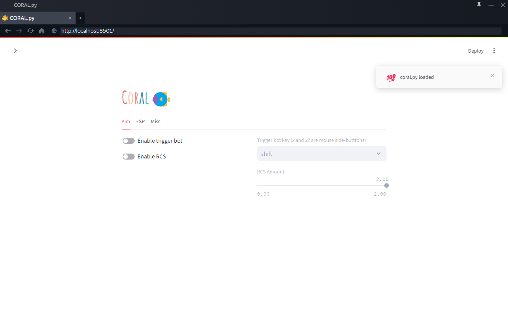

A streamlit web-app built using Python for Counter-Strike 2 modification. **For Educational purposes only.**

<div align="center">

</div>

# Setup

You'll need [a2x's cs2-dumper](https://github.com/a2x/cs2-dumper) for updating offsets at launch. You can finde the `cs2-dumper.exe` under releases.

Once downloaded, place it in the same folder as this repo after cloning.


### 🧬 1. Clone the Repo

```bash
git clone https://github.com/0zean/oasis.git
```

### 📦 2. Install libraries

Install `pip` dependencies from `requirements.txt`:

```bash
pip install -r requirements.txt
```

### 🚀 3. Run the application

To start the streamlit app, have CS2 running and double-click `start.bat`. This will run the offset dumper and start the streamlit server.

The web app will compile and then start running at `http://localhost:8501` which will be automatically copied to the clipboard.